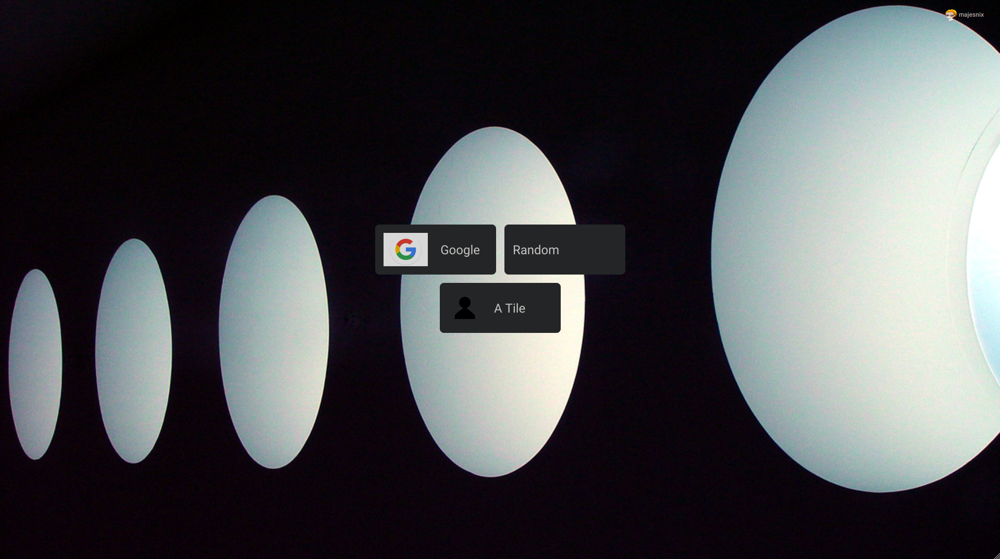

# MajesDash

  
  
  
  

Todo:

- Smart tiles (stats/online check)
- Tags (tile grouping)

## Build

`npm run docker:build` will build both api and client and will also create a docker image called majesdash

## Deploy

A simple deploy could be achieved with a prebuild version `docker run -p 8888:3333 --env-file ./.env codingbros/majesdash`.

This would deploy the dashboard on port 8888.

To persist the dashboard state, the `/app/config` path needs to be mapped somewhere. This directory will contain the sql lite database and all uploaded icons/backgrounds/avatars.

## Environment

The environment variables consist of one simple variable `SECRET`, which will be used to hash passwords. This can either be set through an .env file or directly in the docker run command e.g. like this `docker run -p 8888:3333 -e SECRET=123`

Weather icons from <https://github.com/erikflowers/weather-icons>
